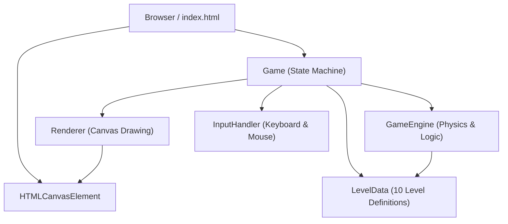
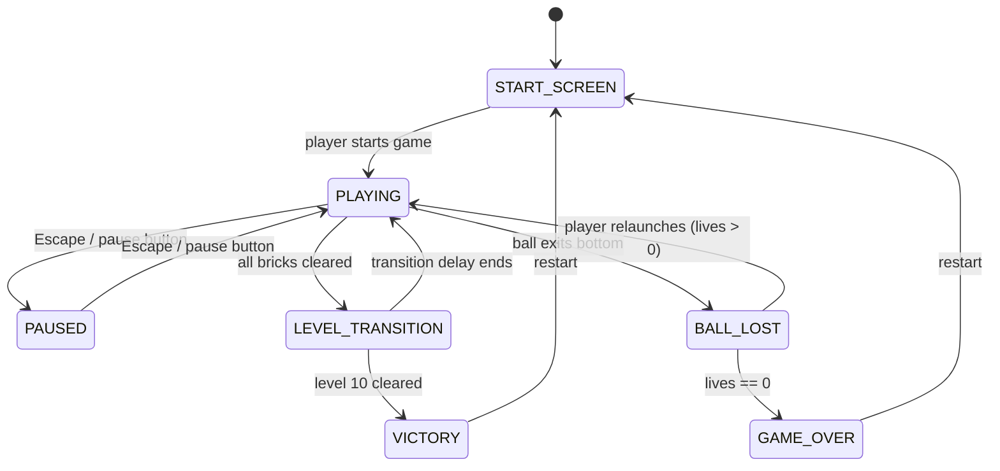

# Design Document: Bricks Game

## Overview

A web-based Breakout/Arkanoid-style game running entirely in the browser using HTML5 Canvas and vanilla JavaScript (no frameworks, no plugins). The player controls a paddle to bounce a ball and destroy all bricks across 10 progressively harder levels.

The architecture follows a classic game loop pattern: a fixed-timestep update cycle drives physics and game state, while a render pass draws the current state each animation frame. Modules are separated by concern: Game Engine (logic/physics), Renderer (drawing), Input Handler (input capture), and a top-level Game controller that orchestrates state transitions.

### Technology Choices

- HTML5 Canvas 2D API for rendering
- Vanilla JavaScript (ES6 modules)
- `requestAnimationFrame` for the game loop
- No external dependencies — fully self-contained

---

## Architecture



### Game State Machine



### Game Loop

```
requestAnimationFrame loop:
  1. InputHandler.update()        — snapshot current input state
  2. GameEngine.update(dt)        — physics, collision, state changes
  3. Renderer.render(gameState)   — draw everything
```

---

## Components and Interfaces

### Game (Orchestrator)

Owns the top-level state machine and wires all modules together.

```js
class Game {
  constructor(canvas)
  start()                        // begin requestAnimationFrame loop
  setState(newState)             // transition between GameState values
  getState()                     // returns current GameState
  reset()                        // full reset to initial conditions
}
```

### GameEngine

Handles all physics, collision detection, scoring, and game rule enforcement.

```js
class GameEngine {
  constructor(config)
  update(dt)                     // advance simulation by dt milliseconds
  initLevel(levelIndex)          // load brick layout, reset ball/paddle
  launchBall()                   // give ball its initial velocity
  getPaddleX()                   // current paddle center x
  getScore()                     // current score
  getLives()                     // remaining lives
  getCurrentLevel()              // 1-based level number
  getBallState()                 // { x, y, vx, vy, radius }
  getPaddleState()               // { x, y, width, height }
  getBricks()                    // array of Brick objects
  isLevelComplete()              // true when no bricks remain
}
```

### Renderer

Stateless drawing module — given game state, draws a frame.

```js
class Renderer {
  constructor(ctx, config)
  render(gameState, engine)      // full frame draw
  drawBall(ball)
  drawPaddle(paddle)
  drawBricks(bricks)
  drawHUD(score, lives, level)
  drawStartScreen()
  drawPauseOverlay()
  drawLevelTransition(levelNumber)
  drawGameOver(score)
  drawVictory(score)
}
```

### InputHandler

Captures keyboard and mouse events; exposes a clean snapshot each frame.

```js
class InputHandler {
  constructor(canvas)
  update()                       // process queued events
  getMouseX()                    // last known mouse x over canvas
  isKeyDown(key)                 // true if key is currently held
  wasKeyPressed(key)             // true once per keydown event
  destroy()                      // remove event listeners
}
```

### LevelData

Pure data module — exports the 10 level definitions.

```js
// Each level: array of rows, each row: array of brick descriptors
// { hp: number, points: number } or null (empty cell)
const LEVELS = [ /* 10 level arrays */ ]
```

---

## Data Models

### GameState (enum)

```js
const GameState = {
  START_SCREEN:       'START_SCREEN',
  PLAYING:            'PLAYING',
  PAUSED:             'PAUSED',
  BALL_LOST:          'BALL_LOST',
  LEVEL_TRANSITION:   'LEVEL_TRANSITION',
  GAME_OVER:          'GAME_OVER',
  VICTORY:            'VICTORY',
}
```

### Ball

```js
{
  x: number,       // center x (pixels)
  y: number,       // center y (pixels)
  vx: number,      // velocity x (pixels/ms)
  vy: number,      // velocity y (pixels/ms)
  radius: number,  // collision radius (pixels)
}
```

### Paddle

```js
{
  x: number,       // left edge x
  y: number,       // top edge y (fixed near bottom)
  width: number,
  height: number,
  speed: number,   // pixels/ms for keyboard movement
}
```

### Brick

```js
{
  col: number,     // grid column index
  row: number,     // grid row index
  x: number,       // pixel x (computed from col)
  y: number,       // pixel y (computed from row)
  width: number,
  height: number,
  hp: number,      // current hit points (0 = destroyed)
  maxHp: number,   // original hit points (for color tier)
  points: number,  // score value when destroyed
  active: boolean, // false when destroyed
}
```

### GameConfig

```js
{
  canvasWidth: number,
  canvasHeight: number,
  ballRadius: number,
  ballInitialSpeed: number,    // pixels/ms
  ballSpeedIncrement: number,  // added per level
  paddleWidth: number,
  paddleHeight: number,
  paddleSpeed: number,
  brickRows: number,
  brickCols: number,
  brickPadding: number,
  brickOffsetTop: number,
  brickOffsetLeft: number,
  levelCompletionBonus: number,
  totalLevels: number,         // 10
}
```

### Level Definition (per level in LevelData)

```js
// 2D array [row][col] of brick descriptors or null
type BrickDescriptor = { hp: number, points: number } | null
type LevelLayout = BrickDescriptor[][]
```

### 10 Level Layouts (summary)

| Level | Description | Max HP | Rows |
|-------|-------------|--------|------|
| 1 | All single-hit bricks, simple grid | 1 | 3 |
| 2 | Single-hit, 4 rows | 1 | 4 |
| 3 | Mix of 1-hp and 2-hp bricks | 2 | 4 |
| 4 | Checkerboard pattern, 2-hp bricks | 2 | 5 |
| 5 | Diamond/pyramid shape, 2-hp | 2 | 5 |
| 6 | 3-hp bricks introduced, 5 rows | 3 | 5 |
| 7 | Mixed 1/2/3-hp, dense layout | 3 | 6 |
| 8 | Fortress pattern, 3-hp outer ring | 3 | 6 |
| 9 | Sparse high-value bricks + dense low | 3 | 7 |
| 10 | Full grid, all 3-hp bricks | 3 | 7 |

---

## Correctness Properties

*A property is a characteristic or behavior that should hold true across all valid executions of a system — essentially, a formal statement about what the system should do. Properties serve as the bridge between human-readable specifications and machine-verifiable correctness guarantees.*


### Property 1: Paddle mouse tracking

*For any* mouse x position within the canvas bounds, after the input handler processes the event, the paddle's center x should equal the clamped mouse x position (clamped to keep the paddle fully within the play area).

**Validates: Requirements 2.1, 2.4, 2.5**

### Property 2: Paddle keyboard movement direction

*For any* paddle position not at a boundary, pressing the left arrow key for a fixed time step should decrease paddle x, and pressing the right arrow key should increase paddle x, each by exactly `paddleSpeed * dt`.

**Validates: Requirements 2.2, 2.3**

### Property 3: Paddle boundary clamping

*For any* paddle position and any input (mouse or keyboard), the paddle's x coordinate should always satisfy `0 <= paddle.x` and `paddle.x + paddle.width <= canvasWidth`.

**Validates: Requirements 2.4, 2.5**

### Property 4: Ball launch speed invariant

*For any* level, immediately after the ball is launched, the ball's speed magnitude (`sqrt(vx² + vy²)`) should equal the configured initial speed for that level, and both `vx` and `vy` should be non-zero.

**Validates: Requirements 3.1**

### Property 5: Wall reflection preserves speed

*For any* ball velocity and wall contact (top, left, or right boundary), after the reflection the ball's speed magnitude should be unchanged, and the component perpendicular to the wall should negate while the parallel component stays the same.

**Validates: Requirements 3.2**

### Property 6: Paddle reflection sends ball upward

*For any* ball position and velocity at the moment of paddle contact, after the collision the ball's `vy` should be negative (moving upward).

**Validates: Requirements 3.3**

### Property 7: Paddle edge deflection changes horizontal direction

*For any* ball contacting the left third of the paddle, the resulting `vx` should be negative; for any ball contacting the right third, `vx` should be positive.

**Validates: Requirements 3.4**

### Property 8: Brick hp decrement on hit

*For any* brick with `hp > 1`, after one ball collision the brick's `hp` should decrease by exactly 1 and `active` should remain `true`. For any brick with `hp == 1`, after one ball collision `active` should be `false`.

**Validates: Requirements 4.2, 4.3**

### Property 9: Score increases by brick point value on destruction

*For any* brick destruction event, the score after the event should equal the score before plus exactly that brick's `points` value.

**Validates: Requirements 4.4, 5.1**

### Property 10: Brick grid layout invariant

*For any* level index (1–10), after `initLevel`, all active bricks should have `y` positions within the top portion of the play area (`y < canvasHeight / 2`) and their positions should correspond to a regular grid (uniform spacing).

**Validates: Requirements 4.1**

### Property 11: Distinct colors per hp tier

*For any* two bricks with different `maxHp` values, the renderer should assign them different fill colors. The ball and paddle colors should also differ from each other and from all brick tier colors.

**Validates: Requirements 4.5, 9.3**

### Property 12: HUD always shows current score and lives

*For any* score value and lives value during PLAYING state, the rendered HUD output should contain the exact current score and lives count.

**Validates: Requirements 5.2, 6.3**

### Property 13: Ball loss decrements lives by one

*For any* game state where the ball's `y` exceeds the canvas height, after the engine processes that frame, `lives` should equal the previous lives minus 1.

**Validates: Requirements 6.1**

### Property 14: Ball and paddle reset after ball loss

*For any* ball loss event where `lives > 0`, after the reset the ball and paddle should be at their configured starting positions and the game state should be BALL_LOST (awaiting relaunch).

**Validates: Requirements 6.2**

### Property 15: Level transition on all bricks cleared

*For any* level where all bricks become inactive in the same frame, the game state should transition to LEVEL_TRANSITION (and subsequently to the next level or VICTORY if on level 10).

**Validates: Requirements 7.1**

### Property 16: Ball speed increases each level

*For any* level `n` where `n > 1`, the ball's initial speed at level `n` should be strictly greater than the ball's initial speed at level `n - 1`.

**Validates: Requirements 7.2**

### Property 17: Pause freezes ball position

*For any* game state in PLAYING, after a pause input the game state should be PAUSED, and subsequent calls to `engine.update(dt)` should not change the ball's position.

**Validates: Requirements 10.1**

### Property 18: Pause-unpause round trip preserves state

*For any* game state snapshot taken while PLAYING, pausing and then unpausing should produce a game state identical to the snapshot (same ball position/velocity, paddle position, score, lives, brick states).

**Validates: Requirements 10.3**

### Property 19: Render completeness during play

*For any* PLAYING state, the renderer's draw calls should include the ball, paddle, all active bricks, and the HUD — no active game element should be omitted from a frame.

**Validates: Requirements 9.1**

---

## Error Handling

### Ball Escape Edge Cases
- If floating-point drift causes the ball to tunnel through a thin brick or boundary, the engine should clamp the ball back to the boundary and apply the reflection. A swept-collision check (comparing previous and current position) prevents tunneling at high speeds.

### Invalid Level Index
- Requesting a level outside 1–10 should be a no-op; the engine logs a warning and stays on the current level.

### Canvas Resize
- If the browser window resizes, the canvas dimensions are recalculated and the play area is re-scaled. All game coordinates are stored in logical units and scaled to pixels at render time, so no game state needs to be recalculated.

### Input During Non-Playing States
- Keyboard and mouse events are processed but movement commands are ignored when the game state is not PLAYING. Only the pause toggle and restart inputs are active in their respective states.

### NaN / Infinity in Physics
- After each physics update, the engine validates that ball `x`, `y`, `vx`, `vy` are finite numbers. If not, the ball is reset to its starting position (treated as a ball loss).

---

## Testing Strategy

### Dual Testing Approach

Both unit tests and property-based tests are required. They are complementary:
- Unit tests catch concrete bugs at specific inputs and verify integration points.
- Property-based tests verify universal correctness across the full input space.

### Unit Tests

Focus on:
- Game initialization: score == 0, lives == 3, state == START_SCREEN after construction
- Level data: `LEVELS.length == 10`, all layouts are non-empty, no two layouts are identical
- State transitions: start → playing, playing → paused → playing, playing → game-over, playing → victory
- Level completion bonus is added to score when level clears
- Game-over transition when lives reaches 0
- Victory transition when level 10 clears
- Restart resets all state to initial values
- Pause overlay is rendered when state is PAUSED
- Level transition screen shows correct level number

### Property-Based Tests

Use a property-based testing library (e.g., **fast-check** for JavaScript).

Configure each test to run a minimum of **100 iterations**.

Each test must include a comment referencing its design property:

```
// Feature: bricks-game, Property N: <property_text>
```

| Property | Test Description |
|----------|-----------------|
| P1 | For random mouse x values, paddle.x is clamped correctly |
| P2 | For random dt values, keyboard input moves paddle by paddleSpeed * dt |
| P3 | For random inputs, paddle x always stays within [0, canvasWidth - paddleWidth] |
| P4 | For any level, launched ball speed magnitude equals configured speed |
| P5 | For random ball velocities hitting walls, speed magnitude is preserved |
| P6 | For random paddle contact positions, post-collision vy < 0 |
| P7 | For random contact in left/right thirds, vx sign matches expected deflection |
| P8 | For random bricks with hp 1..3, collision decrements hp or deactivates correctly |
| P9 | For random brick point values, score delta equals brick.points on destruction |
| P10 | For all 10 levels, bricks are positioned in the top half in a regular grid |
| P11 | For random hp tier pairs, assigned colors are distinct |
| P12 | For random score/lives values, HUD render contains those exact values |
| P13 | For any ball-exits-bottom event, lives decreases by exactly 1 |
| P14 | For any ball loss with lives > 0, ball and paddle return to start positions |
| P15 | For any state where all bricks are inactive, game transitions away from PLAYING |
| P16 | For levels 2–10, initial ball speed is strictly greater than previous level |
| P17 | For any PLAYING state, after pause, engine.update does not move the ball |
| P18 | For any PLAYING snapshot, pause then unpause produces identical state |
| P19 | For any PLAYING state, render draws ball, paddle, all active bricks, and HUD |
