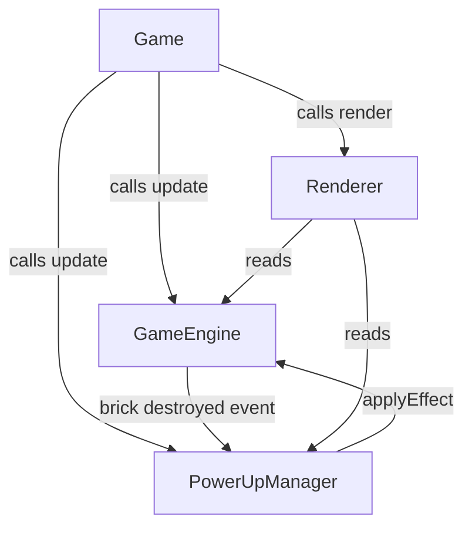

# Design Document: Random Power-Ups

## Overview

This feature adds randomly spawning power-up tokens to the Bricks Game. When a brick is destroyed, there is a 20% chance a power-up token falls from that brick's position toward the paddle. Catching the token applies one of four effects: Multi_Ball, Extra_Life, Wide_Paddle, or Slow_Ball.

The implementation extends the existing single-file architecture (`game.html`) by adding a `PowerUpManager` class and modifying `GameEngine` and `Renderer` to integrate power-up state. No new files are required; all code lives in the existing `<script>` block.

### Key Design Decisions

- **Single-file extension**: The game is a self-contained HTML file. New classes are appended to the script block rather than split into modules, keeping deployment simple.
- **PowerUpManager owns falling tokens**: Spawning, movement, collision with paddle, and expiry are all handled by `PowerUpManager`, keeping `GameEngine` focused on physics and game state.
- **Timed effects stored in GameEngine**: Wide_Paddle and Slow_Ball durations are tracked inside `GameEngine` because they affect paddle width and ball speed, which are already owned there.
- **Multi-ball via array of balls**: `GameEngine._ball` becomes `GameEngine._balls` (an array). All existing single-ball logic is updated to iterate over the array.

---

## Architecture



The `Game` orchestrator drives the loop. On each tick it:
1. Calls `engine.update(dt)` — physics, brick collisions, timed effect countdowns.
2. Calls `powerUpManager.update(dt, paddle)` — moves tokens, checks paddle collision, removes expired tokens.
3. Calls `renderer.render(state, engine, powerUpManager)` — draws everything.

When `GameEngine._checkBrickCollisions()` destroys a brick it fires a callback (`onBrickDestroyed`) that `PowerUpManager` uses to decide whether to spawn a token.

---

## Components and Interfaces

### PowerUpManager

```js
class PowerUpManager {
  constructor(config)

  // Called by GameEngine when a brick is destroyed
  onBrickDestroyed(brick)           // may spawn a token at brick center

  // Called each frame
  update(dt, paddle)                // move tokens, detect paddle collision, remove out-of-bounds

  // Called by Game on state transitions
  clearTokens()                     // remove all active falling tokens

  // Read by Renderer
  getTokens()                       // returns array of token objects

  // Callback set by Game; called when a token is caught
  // signature: (powerUpType) => void
  onCollect = null
}
```

Token object shape:
```js
{ x, y, type }   // type is one of PowerUpType values
```

### PowerUpType constant

```js
const PowerUpType = {
  MULTI_BALL:  'MULTI_BALL',
  EXTRA_LIFE:  'EXTRA_LIFE',
  WIDE_PADDLE: 'WIDE_PADDLE',
  SLOW_BALL:   'SLOW_BALL',
};
```

### GameEngine changes

| Addition | Purpose |
|---|---|
| `_balls` array (replaces `_ball`) | Support multiple simultaneous balls |
| `_widePaddleTimer` | Remaining ms for Wide_Paddle effect |
| `_slowBallTimer` | Remaining ms for Slow_Ball effect |
| `_paddleBaseWidth` | Original paddle width for restoration |
| `applyPowerUp(type)` | Dispatches to the correct effect handler |
| `getBalls()` | Returns array of ball state snapshots |
| `onBrickDestroyed` callback | Notified by `_checkBrickCollisions` |

`update(dt)` gains timer countdown logic:
- Decrement `_widePaddleTimer` by `dt`; restore paddle width when it reaches 0.
- Decrement `_slowBallTimer` by `dt`; restore ball speeds when it reaches 0.

### Renderer changes

- `drawBall(ball)` → `drawBalls(balls)` iterates the array.
- `drawPaddle(paddle, isWide)` — uses orange fill when `isWide` is true.
- `drawBalls(balls, isSlow)` — uses blue fill when `isSlow` is true.
- `drawPowerUpTokens(tokens)` — draws each token as a colored capsule with a short label.
- `render(state, engine, powerUpManager)` gains the third parameter.

---

## Data Models

### PowerUp Token (runtime, not persisted)

```js
{
  x:    Number,   // horizontal center, pixels
  y:    Number,   // vertical center, pixels
  type: String,   // one of PowerUpType values
}
```

Tokens are stored in `PowerUpManager._tokens` (plain array). There is no serialization requirement.

### Timed Effect State (inside GameEngine)

```js
_widePaddleTimer: Number   // ms remaining; 0 = inactive
_slowBallTimer:   Number   // ms remaining; 0 = inactive
_paddleBaseWidth: Number   // set once in initLevel
```

### Ball (updated shape)

```js
{
  x, y,           // position
  vx, vy,         // velocity (pixels/ms)
  radius: Number,
  _baseSpeed: Number,  // level base speed, used to restore after Slow_Ball
}
```

`_baseSpeed` is set when a ball is created or when a new level starts, so Slow_Ball expiry can restore the correct speed regardless of how many balls exist.

### Config additions (PowerUpConfig merged into GameConfig)

```js
powerUpSpawnChance:   0.20,   // 20%
powerUpFallSpeed:     0.15,   // pixels/ms
powerUpTokenWidth:    60,
powerUpTokenHeight:   22,
widePaddleMultiplier: 1.75,
widePaddleDuration:   10000,  // ms
slowBallMultiplier:   0.50,
slowBallDuration:     8000,   // ms
maxLives:             9,
```

---

## Correctness Properties

*A property is a characteristic or behavior that should hold true across all valid executions of a system — essentially, a formal statement about what the system should do. Properties serve as the bridge between human-readable specifications and machine-verifiable correctness guarantees.*


### Property 1: Spawn threshold

*For any* brick destruction event, if the random value drawn is less than 0.20 a token is spawned at the brick's position; if the value is >= 0.20 no token is spawned.

**Validates: Requirements 1.1**

---

### Property 2: Spawned token type is valid

*For any* spawned power-up token, its `type` field must be one of the defined `PowerUpType` values (MULTI_BALL, EXTRA_LIFE, WIDE_PADDLE, SLOW_BALL).

**Validates: Requirements 1.2**

---

### Property 3: Token falls at correct speed

*For any* active token and any elapsed time `dt`, after `update(dt)` the token's `y` coordinate increases by exactly `0.15 * dt` pixels.

**Validates: Requirements 1.3**

---

### Property 4: Token removed at bottom boundary

*For any* token whose `y` position exceeds `canvasHeight`, after the next `update` call the token must no longer appear in `getTokens()`.

**Validates: Requirements 1.4**

---

### Property 5: Paddle collision removes token and fires callback

*For any* token positioned to overlap the paddle rectangle, after `update(dt, paddle)` the token is absent from `getTokens()` and the `onCollect` callback is invoked with the token's type.

**Validates: Requirements 2.1**

---

### Property 6: clearTokens empties all tokens

*For any* set of active tokens (including zero), calling `clearTokens()` results in `getTokens()` returning an empty array.

**Validates: Requirements 2.3, 2.4**

---

### Property 7: Multi_Ball doubles ball count

*For any* game state with `n` active balls (n ≥ 1), applying the MULTI_BALL power-up results in exactly `2n` active balls.

**Validates: Requirements 3.1**

---

### Property 8: Non-last ball loss does not decrement lives

*For any* game state with `n` active balls (n ≥ 2), when one ball exits the bottom boundary, the ball count becomes `n - 1` and lives remain unchanged. Edge case: when `n = 1` and the ball is lost, lives decrement by 1 and the game transitions to BALL_LOST.

**Validates: Requirements 3.2, 3.3**

---

### Property 9: Reset transition yields a single ball

*For any* multi-ball game state, after a BALL_LOST transition or a call to `initLevel()`, `getBalls()` returns exactly 1 ball positioned at the starting position.

**Validates: Requirements 3.4, 8.2**

---

### Property 10: Extra_Life increments lives, capped at 9

*For any* lives count `n` where `n < 9`, applying EXTRA_LIFE results in `n + 1` lives. Edge case: when `n = 9`, lives remain at 9.

**Validates: Requirements 4.1, 4.2**

---

### Property 11: Wide_Paddle sets width and timer

*For any* paddle with base width `w`, applying WIDE_PADDLE sets `paddle.width` to `w * 1.75` and `_widePaddleTimer` to 10000 ms.

**Validates: Requirements 5.1**

---

### Property 12: Wide_Paddle expiry restores base width

*For any* game state with Wide_Paddle active, after advancing time by 10000 ms the paddle width equals its base width.

**Validates: Requirements 5.2**

---

### Property 13: Re-applying Wide_Paddle resets timer

*For any* remaining Wide_Paddle timer value, collecting another WIDE_PADDLE token resets `_widePaddleTimer` to exactly 10000 ms.

**Validates: Requirements 5.3**

---

### Property 14: Paddle stays within play area while wide

*For any* paddle position and width (including the widened state), after `_updatePaddle` the paddle satisfies `paddle.x >= 0` and `paddle.x + paddle.width <= canvasWidth`.

**Validates: Requirements 5.4**

---

### Property 15: Slow_Ball sets speed and timer

*For any* set of active balls with level base speed `s`, applying SLOW_BALL sets each ball's speed (velocity magnitude) to `s * 0.5` and `_slowBallTimer` to 8000 ms.

**Validates: Requirements 6.1**

---

### Property 16: Slow_Ball expiry restores speed and preserves direction

*For any* game state with Slow_Ball active, after advancing time by 8000 ms each ball's speed equals the level base speed and each ball's direction (angle of velocity vector) is unchanged.

**Validates: Requirements 6.2**

---

### Property 17: Re-applying Slow_Ball resets timer

*For any* remaining Slow_Ball timer value, collecting another SLOW_BALL token resets `_slowBallTimer` to exactly 8000 ms.

**Validates: Requirements 6.3**

---

### Property 18: New ball launched during Slow_Ball gets reduced speed

*For any* game state where Slow_Ball is active, a newly launched ball's speed equals `levelSpeed * 0.5`.

**Validates: Requirements 6.4**

---

### Property 19: Token rendered with correct color and label per type

*For any* power-up token type, the rendered capsule uses the designated color (MULTI_BALL → cyan, EXTRA_LIFE → green, WIDE_PADDLE → orange, SLOW_BALL → blue) and a non-empty label string. No two types share the same color.

**Validates: Requirements 7.1, 7.2**

---

### Property 20: Paddle rendered differently when Wide_Paddle is active

*For any* paddle state, `drawPaddle` uses a different fill color when `isWide = true` than when `isWide = false`.

**Validates: Requirements 7.3**

---

### Property 21: Balls rendered differently when Slow_Ball is active

*For any* ball state, `drawBalls` uses a different fill color when `isSlow = true` than when `isSlow = false`.

**Validates: Requirements 7.4**

---

### Property 22: Level completion cancels timed effects

*For any* game state with Wide_Paddle and/or Slow_Ball active, after `initLevel()` both `_widePaddleTimer` and `_slowBallTimer` are 0 and paddle width equals base width.

**Validates: Requirements 8.1**

---

### Property 23: Level completion preserves lives

*For any* lives count `n` at the moment a level is completed, after `initLevel()` for the next level the lives count remains `n`.

**Validates: Requirements 8.3**

---

## Error Handling

| Scenario | Handling |
|---|---|
| `onCollect` callback not set | Guard with `if (this.onCollect)` before calling |
| `applyPowerUp` called with unknown type | Log a warning and no-op; do not throw |
| `initLevel` called with out-of-range index | Existing guard (`console.warn`) retained |
| Ball velocity becomes non-finite (NaN/Infinity) | Existing `_resetBallToStart` guard retained; extended to all balls in the array |
| Wide_Paddle makes paddle wider than canvas | Boundary clamp in `_updatePaddle` handles this |
| Slow_Ball applied when no balls exist | No-op; timer still set so new balls launched later get reduced speed |

---

## Testing Strategy

### Dual Testing Approach

Both unit tests and property-based tests are required. They are complementary:
- Unit tests cover specific examples, integration points, and edge cases.
- Property tests verify universal correctness across many generated inputs.

### Property-Based Testing

**Library**: [fast-check](https://github.com/dubzzz/fast-check) (JavaScript, works in Node without a bundler).

Each property test must run a minimum of **100 iterations** (fast-check default is 100; set `numRuns: 100` explicitly).

Each test must include a comment tag in the format:
```
// Feature: random-power-ups, Property N: <property text>
```

Each correctness property listed above maps to exactly one property-based test.

Example skeleton:
```js
import fc from 'fast-check';

// Feature: random-power-ups, Property 3: Token falls at correct speed
test('token y increases by 0.15 * dt', () => {
  fc.assert(fc.property(
    fc.float({ min: 1, max: 500 }),   // dt
    fc.float({ min: 0, max: 550 }),   // initial y
    (dt, initialY) => {
      const mgr = new PowerUpManager(GameConfig);
      mgr._tokens = [{ x: 100, y: initialY, type: PowerUpType.EXTRA_LIFE }];
      mgr.update(dt, { x: -999, y: -999, width: 0, height: 0 }); // paddle far away
      expect(mgr._tokens[0].y).toBeCloseTo(initialY + 0.15 * dt, 5);
    }
  ), { numRuns: 100 });
});
```

### Unit Testing

Unit tests (Jest or Vitest) cover:
- Specific examples: collecting each of the four power-up types and verifying the exact state change.
- Integration: `Game` wiring — `onBrickDestroyed` callback connects `GameEngine` to `PowerUpManager`.
- Edge cases: lives cap at 9, last-ball-lost triggers BALL_LOST, level transition clears tokens.
- Rendering: `drawPowerUpTokens` called with correct arguments for each type.

### Test File Location

```
tests/
  random-power-ups.unit.test.js      # unit tests
  random-power-ups.property.test.js  # property-based tests
```
